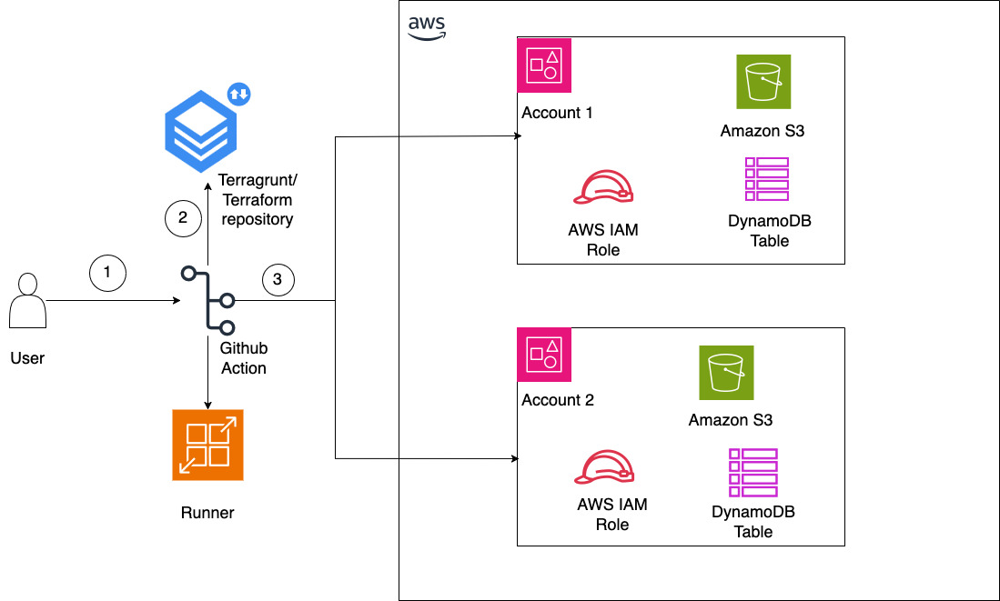

# Automated Infrastructure Provisioning Pipeline

## Overview
A streamlined infrastructure-as-code solution that leverages GitHub Actions workflows to automate resource provisioning based on standardized JSON payloads. InfraFlow creates a flexible provisioning pipeline that can be seamlessly integrated with various UI components or ServiceNow instances to meet diverse organizational needs. Simplify your infrastructure requests, standardize your provisioning process, and accelerate delivery through this configurable automation framework.

This specific repository contains example code that shows how to create AWS VPC resources (virtual networks) by simply providing a JSON file with your requirements. Rather than manually configuring networks through the AWS console or writing complex code, user submit a standardized JSON description and the system builds it for you.

## Features

- Automates Infrastructure Creation: Instead of manually setting up cloud resources, you define what you need in a JSON file
- Uses GitHub Actions: The automation runs through GitHub's built-in workflow system
- Works with Different Front-Ends: You can trigger it from various user interfaces or ServiceNow

## Setup

### Prerequisites

- AWS account with access to Amazon VPC
- GitHub repository with pull request workflow
- Appropriate IAM roles and permissions configured.

### Environment Configuration

1. Required github variables.
   - aws_role - AWS role with appropriate permissions to deploy resources
   - AWS_REGION - Region to connect aws account

2. Required GitHub Secrets:
   - `REPO_CREATION_TOKEN`: GitHub token with permissions perform github operations

### Best Practices

1. Github actions role should have the permission to deploy the resources. Least-privilege IAM policy for GitHub Actions to deploy VPC resources - https://docs.aws.amazon.com/IAM/latest/UserGuide/best-practices.html

sample policy for VPC:

```
{
    "Version": "2012-10-17",
    "Statement": [
        {
            "Effect": "Allow",
            "Action": [
                "ec2:CreateVpc",
                "ec2:DeleteVpc",
                "ec2:ModifyVpcAttribute",
                "ec2:CreateTags",
                "ec2:DeleteTags",
                "ec2:DescribeVpcs"
            ],
            "Resource": "arn:aws:ec2:*:*:vpc/*"
        }
    ]
}
```

2. GitHub Runner:

    https://docs.github.com/en/actions/hosting-your-own-runners/managing-self-hosted-runners/about-self-hosted-runners
    https://aws.amazon.com/blogs/devops/best-practices-working-with-self-hosted-github-action-runners-at-scale-on-aws/

    - Security: Use isolated environments, least privilege accounts, and regularly update runner software.
    - Performance: Size appropriately, use labels for job routing, and implement auto-scaling for variable workloads.
    - Reliability: Set up redundant runners, implement health checks, and use proper error handling and logging.
    - Management: Automate provisioning with IaC, use configuration management tools, and document procedures.
    - Cost Optimization: Implement ephemeral runners, use auto-scaling, and leverage caching strategies to reduce build times.


## Project Structure

```
IAC-Repository/
├── .github/
│   ├── deployment.yml        # Main deployment workflow
│   └── workflow-trigger.yml  # Workflow for creating and processing payloads
└── sample-payload/
    └── payload.json         # Example payload structure
```

## Workflows

### 1. Infrastructure Deployment Workflow
Located in `deployment.yml`, this workflow:
- Triggers on pushes to main branch or payload.json changes
- Runs on github runner
- Performs infrastructure deployment using Terragrunt
- Handles the actual infrastructure provisioning based on the payload

### 2. Workflow Trigger
Located in `workflow-trigger.yml`, this workflow:
- Creates payload.json files based on parameters
- Creates Pull Requests for infrastructure changes
- Automates the parameter file creation process

## Architecture Diagram


1. The user submits a payload to GitHub Actions, which triggers the pipeline.
2. Based on the payload data, the pipeline downloads the infrastructure code from Terragrunt/Terraform repositories.
3. Using the AccountId provided in the payload, the pipeline assumes the appropriate role and deploys resources to the specified account. An S3 bucket and DynamoDB table within the same account are utilized to store the Terraform state file.

## Payload Structure
The infrastructure requests are defined using a standardized JSON structure:

```json
{
    "ref": "main",
    "inputs": {
        "RequestParameters": {
            "RequestId": "1111111",
            "RequestType": "create",
            "ResourceType": "vpc",
            "AccountId": "1234567890",
            "AccountAlias": "account-alias",
            "RegionId": "us-west-2",
            "ApplicationName": "myapp",
            "DivisionName": "division-name",
            "EnvironmentId": "dev",
            "Suffix": "poc"
        },
        "ResourceParameters": [
            {
                "VPC": {
                    "vpc_cidr": "10.0.0.0/16"
                }
            }
        ]
    }
}
```

## Dependencies

- Terraform v1.10
- Terragrunt v0.77

## Usage
1. Submit infrastructure requests by creating a payload.json file
2. The workflow-trigger.yml will process the request and create necessary files
3. deployment.yml will handle the actual infrastructure deployment
4. Monitor the GitHub Actions tab for deployment status and logs

## Recommendations to improve security

- [Use multi-factor authentication for GitHub accounts](https://docs.github.com/en/authentication/securing-your-account-with-two-factor-authentication-2fa/configuring-two-factor-authentication)
- [Implement  strong access controls on the GitHub repository](https://docs.github.com/en/get-started/learning-about-github/access-permissions-on-github)
- [Regularly  audit repository access](https://docs.github.com/en/organizations/keeping-your-organization-secure/managing-security-settings-for-your-organization)
- [Access to data stored in S3 buckets](https://docs.aws.amazon.com/AmazonS3/latest/userguide/security-best-practices.html)
- [Enable  and monitor AWS CloudTrail logs](https://docs.aws.amazon.com/awscloudtrail/latest/userguide/monitor-cloudtrail-log-files-with-cloudwatch-logs.html)
- [security checks in the CI/CD pipeline](https://github.com/marketplace/actions/checkov-github-action)


## Contributing

1. Fork the repository
2. Create a feature branch
3. Commit your changes
4. Push to the branch
5. Create a new Pull Request

## Note
Ensure all payloads follow the standardized format and include all required parameters for successful deployment.

## Security practices

- AWS credentials are handled securely through GitHub Actions
- All sensitive information is stored in GitHub Secrets
- Uses secure AWS role assumption for authentication

## Support

This README provides a comprehensive overview of your Automated Infrastructure Provisioning Pipeline.
